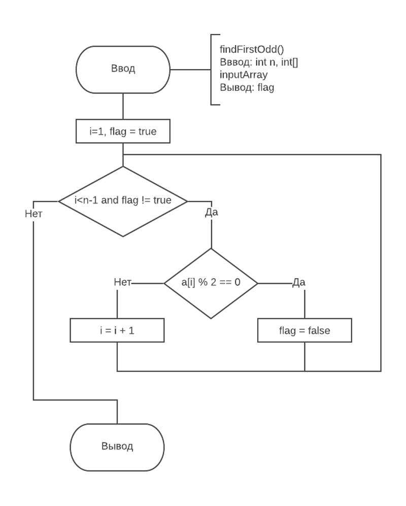

# Ответы на зачёт по АиАЯ
 
## 1. Что такое алгоритм? Какими свойствами он обладает?  
Алгоритм – это конечная последовательность шагов в решении задачи, приводящая от исходных данных к требуемому результату.
Основные свойства алгоритмов следующие:  
*  Понятность для исполнителя — исполнитель алгоритма должен понимать, как его 			выполнять. Иными словами, имея алгоритм и произвольный вариант исходных данных, 			исполнитель должен знать, как надо действовать для выполнения этого алгоритма.  
*  Дискpетность (прерывность, раздельность) — алгоpитм должен пpедставлять пpоцесс 		pешения задачи как последовательное выполнение пpостых (или pанее опpеделённых) 			шагов (этапов).
*  Опpеделенность — каждое пpавило алгоpитма должно быть чётким, однозначным и не 		оставлять места для пpоизвола. Благодаpя этому свойству выполнение алгоpитма носит 			механический хаpактеp и не тpебует никаких дополнительных указаний или сведений о 			pешаемой задаче.  
*  Pезультативность (или конечность) состоит в том, что за конечное число шагов 			алгоpитм либо должен пpиводить к pешению задачи, либо после конечного числа шагов 			останавливаться из-за невозможности получить решение с выдачей соответствующего 			сообщения, либо неограниченно продолжаться в течение времени, отведенного для 				исполнения алгоритма, с выдачей промежуточных результатов.  
*  Массовость означает, что алгоpитм pешения задачи pазpабатывается в общем виде, т.е. 	он должен быть пpименим для некотоpого класса задач, pазличающихся лишь исходными 		данными. Пpи этом исходные данные могут выбиpаться из некотоpой области, котоpая 			называется областью пpименимости алгоpитма.



## 2. Назовите и поясните способы описания алгротиов.
1. словесное описание;
2. описание алгоритма с помощью   математических  формул;
3. графическое описание алгоритма в виде блок-схемы;
4. описание алгоритма с помощью псевдокода;
5. комбинированный способ изображения алгоритма с   использованием словесного, графического и др. способов.

## 3. Нарисуйте и поясните назначения функциональных блоков, используемых в блок-схемах.
* Процесс
* Данные(ввод-вывод)
* Функция
* Условие
* Цикл
* Ограничитель
* Соединитель
* Комментарий

## 4. Перечислите этапы решения задачи, выполняемые в процессе её решения.
1. Постановка задачи
2. Формальное построение модели задачи
3. Построение математической модели задачи
4. Выбор и обоснование метода решения
5. Построение алгоритма
6. Составление программы
7. Отладка
8. Решениезадачинакомпьютереианализрезультатов

## 5. Что входит в алфавит языка Visual C++? Поясните понятие "идентификатор" и расскажите об общих правилах написания идентификаторов.
Алфавит описать легко, слов много. Идентификатор - это имя переменной, функции, класса или другого объекта в языке C++. Мы можем определять идентификаторы любыми словами/именами. Тем не менее, есть несколько общих правил, которые необходимо соблюдать:
* Идентификатор не может быть ключевым словом. Ключевые слова зарезервированы.
* Идентификатор может состоять только из букв (нижнего и верхнего регистра) латинского алфавита, цифр и символов подчёркивания. Это означает, что все другие символы и пробелы — запрещены.
* Идентификатор должен начинаться с буквы (нижнего или верхнего регистра). Он не может начинаться с цифры.
* Язык C++ различает нижний регистр от верхнего. nvalue отличается от nValue и отличается от NVALUE.

## 6. В чём заключается действие оператора присваивания? Каковы две формы записи дробных чисел?
Присваивание — механизм связывания в программировании, позволяющий динамически изменять связи имён объектов данных (как правило, переменных) с их значениями.  
Дробные числа записываются в формате с плавающей точкой `float` и c фиксированной точкой `double`.
Запись дробных может быть представлена в виде n/m или n.m.

## 7. Дайте характеристику каждому типу данных языка Visual C++.


## 8. Назовите приоритеты операций.
Приоритет | Операция
--------- | --------
1 | постфиксные инкремент/декремент
2 | префиксный инкремент/декремент
3 | умножение, деление и остаток от деления
4 | сложение и вычитание
5 | `<`, `<=`, `>`, `>=`
6 | `==`, `!=`
7 | `&&`
8 | `||`
9 | тернарный оператор `?:`
10 | `=`, `*=`, `/=`, `%=`, `+=`, `-=`

## 9. Какие операции определены над данными целого типа?
Сложение, вычитание, умножение, деление, остаток от деления, возведение в степень, больше, меньше, тригонометрические функции.

## 10. Какие логические операции могут выполняться над данными логического типа?
Конъюнкция, дизъюнкция и логическое ==

## 11. Для каких действий используется комментирование в программах? Какими способами можно комментировать код?
Комменантари используются для описания части кода.  
* `//` для однострочного комментария
* `/* */` для многострочного комментария

## 12. Какие инструкции необходимо прописывать в программах, чтобы использовать математичекие функции?
`#include <cmath>` после чего указывать класс `Math` использовать `log`, `log10`, `pow`, `abs`, `sin`, `tan` и т.д.

## 13. Какова роль директив `#include <iostream>` и `using namespace std`?
`iostream` — заголовочный файл с классами, функциями и переменными для организации ввода-вывода, который содержит `std`;  
`std` --- пространство имён стандартной библиотеки C++. В ней находятся `cin`, `cout`, `string`, `list`, `map` и другие.

## 14. Какие методы ввода и вывода используются для приложений на Visual C++? Напишите синтаксис используемых методов.
```c++
TextBox->Text;
richTextBox
MessageBox::Show(text, caption, buttons, icon);
Interaction::InputBox("enter number", "enter", "0.5", -1, -1);
```

## 15. Каким образом происходит взаимоотношение двух форм? Поясните на примере.
В конструкторе формы, в которую нужно передать данные, необходимо описать логику сохранения данных, а также добавить приватные поля в класс формы. После чего в форме, из которой передаются данные, вызвать конструктор и передать информацию. Далее скрыть текущую форму и открыть созданную.

```c++
#include <MyForm1.h>
...
Form^ f = gcnew MyForm1();
f->Show();
this->Hide();
``` 

## 16. Какие методы языка используются для ввода-вывда данных из текстовых полей?
```c++
int a = Convert::ToInt32(textBox1->Text);
comboBox1->Items[n]
listBox1->Items[n]
```

## 17. Какие методы преобразования типовы вы знаете?
Явные преобразования `(int)` и неявные `int n = inputDouble`
```c++
Convert::ToString();
Convert::ToInt32();
Convert::ToInt64();
Convert::ToDouble();
Convert::ToFloat();
```

## 18. Как записываются условные операторы в блок-схемах? 

## 19. Расскажите о способах нахождения минимального и максимального значений из нескольких возможных.
```c++ 
int a = 1, b = 2, c = 3, max;
max = a;

if (max < b) { max = b; }
if (max < c> { max = c; }
...
if (max < n) { max = n };
```
```c++
int[] numbers = new int[k];
max = numbers[0];
for (int i = 0; i <  k; ++i) {
  if (max < numbers[i]) {
	  max = numbers[i];
	}
}
```

## 20. Нарисуйте общий вид в алгоритме оператора циклов с неизвестным количеством операций.

## 21. Напишите преимущества, которые получает программист, в результате написания собственных функций.

## 22. Напишите синтаксис функций.
`void Class1::function() {}`
`Class1::function();`

## 23. В чём разница между передачей параметрв по ссылке и по значению?

## 24. Какова роль прототипов функций?
1. Уведомление компилятора о созданной функции
2. Возможность быстро понять, какие функции исользуются, какие аргументы принимают и какой тип значения возвращают.

## 25. Поясните алгоритм вывода рекуррентной формулы.
1. найти an+1 = an + 1
2. найти q = an+1 / an
3. an+1 = q * an

## 26. В чём заключается идея сзодания модульного(многофалового) приложения ?
При данной архитектуре возможна быстрая передача DLL-библиотек и объектов файлов, что позволяет облегчить обмен кодом между разработчиками. Также отсутствует повторение уже написанного кода. Код программы более удобочитаем и требуется меньшее время для компиляции.

## 27. Назовите алгоритм подключения разработанного модуля к проекту.
Допустим, наш модуль библиотека. В таком случае необходимо перейти через обозреватель решений в меню ссылки проекта, затем нажать на «добавить ссылку» и там нажать на кнопочку обзор, после чего найти `.dll` файл и добавить его.

## 28. Каким образом осуществляется доступ к каждому элементу одномерного массива при его обработке?
Первый способ связан с использованием обычных индексных выражений в квадратных скобках, например, array[16]=3 или array[i+2]=7. При таком способе доступа записываются два выражения, причем второе выражение заключается в квадратные скобки. Одно из этих выражений должно быть указателем, а второе - выражением целого типа.
Второй способ доступа к элементам массива связан с использованием адресных выражений и операции разадресации в форме *(array+16)=3 или *(array+i+2)=7. При таком способе доступа адресное выражение равное адресу шестнадцатого элемента массива тоже может быть записано разными способами *(array+16) или *(16+array).
При реализации на компьютере первый способ приводится ко второму, т.е. индексное выражение преобразуется к адресному. Для приведенных примеров array[16] и 16[array] преобразуются в *(array+16).

## 29. Какой массив называется динамическим? Пречислите шаги алгоритма при создании таких массивов с использованием указателей.
Динамическим называется массив, размер которого может изменяться во время исполнения программы.
Указатели представляют собой объекты, значением которых служат адреса других объектов (переменных, констант, указателей) или функций. Как и ссылки, указатели применяются для косвенного доступа к объекту.
```c++
int *array = new int[length]();
```

## 30. Назовите и поясните работу базовых алгоритмов обработки массивов.
1. Сумма и количество по критерию
1. Определение максимального и минимального значений с критерием
1. Удаление / вставка элемента
1. Определение на монотонность
1. Определение на выполнение критерия

## 31. Поясните, каким образом происходит обмен значений элементов массива.
```c++
int buf = a[i];
a[i] = b[j];
b[j] = buf;
```

## 32. Назовите основные способы упорядычивания массивов.
1. Сортировка пузырьком
1. Сортировка перемешиванием (шейкерная сортировка)
1. Сортировка вставками
1. Сортировка выбором

## 33. Расскажите алгоритм сортировки массива прямым перебором.
На каждой итерации цикла по массиву находить минимум, после чего добавлять его в конец результирующего массива, после чего удалять этот элемент из исходного массива и повторять операцию до тех пор, пока в исходном массиве не останется чисел.

## 34. Удаление элемента из одномерного массива.


## 35. Вставка элемента.


## 36. Определение на монотонность.


## 37. Выполнение критерия.


## 38. Сортировка простой вставкой.
Сортировка вставкамb — алгоритм сортировки, в котором элементы входной последовательности просматриваются по одному, и каждый новый поступивший элемент размещается в подходящее место среди ранее упорядоченных элементов.


## 39. Сортировка бинарными вставками.
Алгоритм похож на сортировку простой вставкой, но поиск места для вставки нового элемента осуществляется бинарно.


## 40. Сортировка просытм выбором.
1. Находим номер минимального значения в текущем списке
2. производим обмен этого значения со значением первой неотсортированной позиции (обмен не нужен, если минимальный элемент уже находится на данной позиции)
3. теперь сортируем хвост списка, исключив из рассмотрения уже отсортированные элементы

 

## 41. Сортировка простым обменом 1.
Алгоритм сортировки прямым обменом основан на принципе сравнения и обмена пары соседних элементов до тех пор, пока не будут отсортированы все элементы. Как и в методе прямого выбора, совершаются проходы по массиву, сдвигая каждый раз наименьший элемент оставшейся последовательности к началу массива.


## 42. Сортировка простым обменом 2.
Работает как и первый способ, но используется булевая переменная, чтобы понять, отсортирован ли массив и предотвратить ненужные операции.

 

## 43. Шейкер-сортировка.
Следующая модификация в методе пузырьковой сортировки. Границы рабочей части массива (то есть части массива, где происходит движение) устанавливаются в месте последнего обмена на каждой итерации. Массив просматривается поочередно справа налево и слева направо.

 

## 44. Каким образом можно инициализировать двумерный массив? Расскажите об осноных способах ввода элементов двумерного массива.
```c++
int** matrix = new int* [n];
for (int i = 0; i < n; ++i) {
	matrix[i] = new int[m];
}

for (int i = 0; i < n; ++i) {
	for (int j = 0; j < m; ++j) {
		matrix[i][j] = k;
	}
}
```
Ввести элементы двумерного массива можно либо из другого двумерного массива, либо используя генерацию случайных чисел в указанном диапозоне, либо запрашивая пользователя ввести вручную значение каждого элемента.

## 45. Каким образом можно организовать создание динамических двумерных массивов?
```c++
// объявление двумерного динамического массива на 10 элементов:
float **ptrarray = new float* [2]; // две строки в массиве
    for (int count = 0; count < 2; count++)
        ptrarray[count] = new float [5]; // и пять столбцов
//  где ptrarray  – массив указателей на выделенный участок памяти под массив вещественных чисел  типа float
```
Сначала объявляется указатель второго  порядка `float **ptrarray`, который ссылается на массив указателей  `float* [2]`, где размер массива равен двум. После чего в цикле for каждой строке массива объявленного в строке 2 выделяется память под пять элементов. В результате получается двумерный динамический массив  `ptrarray[2][5]`. Рассмотрим пример высвобождения памяти отводимой под двумерный динамический массив.
```c++

for (int i = 0; i < n; ++i) {
	delete ptrarray[i];
}
delete ptrarray;
```

## 46. Назовите основные свойства матриц.
1. Матрицей размером m×n называется прямоугольная таблица элементов a<sub> i j</sub>, принадлежащих некоторому множеству (как правило, это числа или функции), состоящая из m строк и n столбцов.

2. Квадратная матрица n-го порядка имеет n строк и n столбцов.
3. Если строки и столбцы в матрице A поменять местами, то новая матрица будет называться транспонированной. Транспонированная матрица обозначается как A<sup>T</sup>.
4. Рассказать про главную и побочную диагонали.

## 47. Как происходит инииализация элементов матрицы?
```c++

srand(time(0));
for (int i = 0; i < rowsCount; ++i) {
	for (int j = 0; j < columnsCount; ++j) {
		matrix[i][j] = (int)rand() % 101;
	}
}
```

## 48. Как располагается двумераный массив в оперативной памяти и интерпритируеся программистом?
Двумерная матрица будет располагаться в оперативной памяти в форме ленты, состоящей из элементов строк. При этом индекс любого элемента двумерной матрицы можно получить по формуле `index = i*m+j;`, где i - номер текущей строки; j - номер текущего столбца.

## 49. Напишите кодом способ создания целочисленного массива целых чисел.
```c++

srand(time(0));
for (int i = 0; i < n; ++i) {
	for (int j = 0; j < m; ++j) {
		matrix[i][j] = (int)rand() % 1001;
	}
}
```

## 50. Изложите базовые алгоритмы обработки матриц, начертив соответсвующие алгоритмы и пояснив их.
1. Нахождение суммы и количества по критерию
1. Определение максимального / минимального элементов по критерию
1. Удаление / вставка элемента
1. Формирование нового двумерного массива
1. Определение на монотонность
1. Определение на выполнение критерия

## 51. Какие действия необходимо выполнить при записи информации в текстовый файл?
1. Инициализировать путь к файлу;
1. Инициализировать переменную кодировки `Text::Encoding::GetEncoding(1251);`
1. Создать объект `IO::StreamWriter(filename, false, encoding);`
1. В цикле произвести запись строк с помощью `Write` или `WriteLine`;
1. Закрыть файл `writer->Close()`;

## 52. Назовите константы, которые определют режим открытия файла
Константа | Описание
--------- | --------
`ios::in` | открыть файл для чтения
`ios::out` | открыть файл для записи
`ios::ate` | при открытии переместить указатель в конец файла
`ios::app` | открыть файл для записи в конец файла
`ios::trunc` | удалить содержимое файла, если он существует
`ios::binary` | открытие файла в двоичном режиме

## 53. Какие действия необходимо выполнить за чтения информации из файла?
1. Инициализировать путь к файлу
1. Инициализировать объект `IO::StreamReader(filePath);`
1. Считать данные в цикле с помощью `reader->ReadLine();`
1. Закрыть файл `reader->Close()`;

## 54. Назовите методы класса `ifstream`, которые определяют режим ввода файлового потока и дайте им краткую характеристику.
Название | Действие
-------- | --------
ifstream in; | ввод
ofstream out; |  вывод
fstream both; | ввод и вывод

## 55. Поясните алгоритмический порядок действий для записи информации в текстовый файл при разработке Windows-приложений.
1. Инициализация информации для записи
1. Запрос у пользователя пути для сохранения файла
1. Открытие, запись и закрытие файла
1. Отлавливание ошибок
1. Сообщение об успешной записи или ошибки
